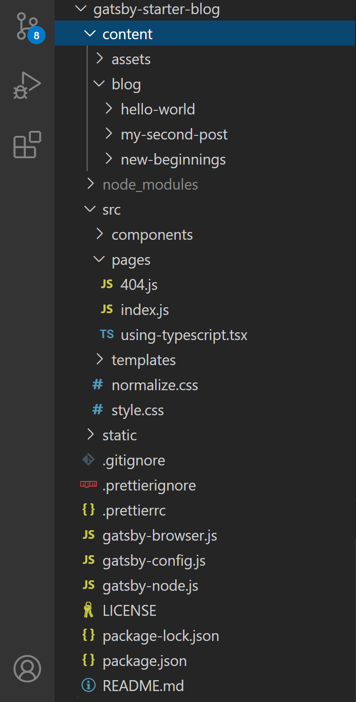
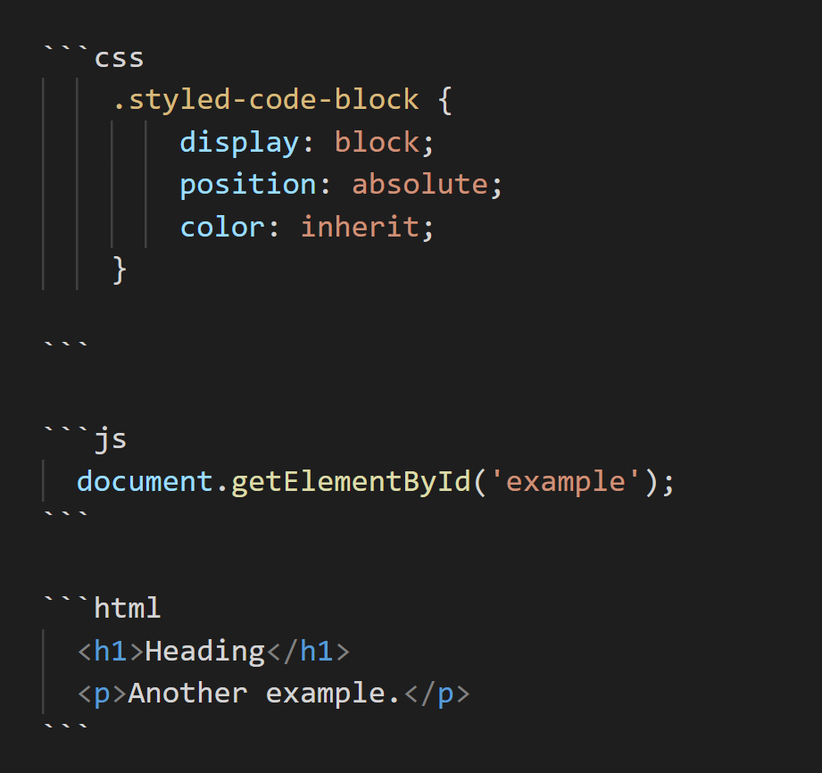

You've written code using an IDE like Visual Studio Code or Sublime. Maybe you've built a blog that uses code blocks like I have. You may have been wondering how to go from:

```
    .unstyled-code-block {
        display: block;
        position: absolute;
        color: none;
    }
```

to:

```css
    .styled-code-block {
        display: block;
        position: absolute;
        color: inherit;
    }

```

### **What is Syntax Highlighting?**

Syntax highlighting is a feature that displays text in different colors and fonts according to a category of terms. The intention of syntax highlighting is to create visual distinctions for readers. Text editors such as Visual Studio Code, Vim, and Sublime all utilize this feature. Code is far easier to interpret with these distinctions.

### **PrismJS**

[PrismJS](https://prismjs.com/) is a lightweight syntax highlighter built with Javascript. PrismJS can be included with any website, but for this tutorial I'll be installing it with Gatsby. 

Here's a link for more information on how you can use their library: [PrismJS Docs - Basic Usage](https://prismjs.com/#basic-usage)

### **Installation with GatsbyJS**

**Prerequisites**
    - Beginner knowledge of Gatsby (or React)

**Step One - Create a Gatsby Project**

For this tutorial, we'll be using an easily customizable Gatsby Starter: [gatsby-starter-blog](https://www.gatsbyjs.com/starters/gatsbyjs/gatsby-starter-blog/). This starter includes support for a full-featured blog with optimized images and markdown posts. Create a new folder, open up a terminal, and run the following command to install:

`gatsby new gatsby-starter-blog https://github.com/gatsbyjs/gatsby-starter-blog`

This creates a new Gatsby site with the name 'gatsby-starter-blog', we're then appending it to include this starter's source code from Github

Our new project structure should look something like this:



Along with our site's `node_modules`, `package.json`, and configuration files, we should also see:

- `content/` holds our image assets and markdown blog posts
- `src/` contains our website's components (layout.js, bio.js, seo.js), pages (index.js, 404.js), templates (blog-post.js, our single post template file), and our CSS files (normalize.css, style.css)
- `static/` contains static files that are generated upon build

**Step Two - Install Required Plugins**

Ensure that your new Gatsby site is working by opening up a terminal, navigating into your project's folder and run: `npm start`. This builds your Gatsby site which you can now view at *localhost:8000*

Next, we'll need to ensure that three important packages are installed in our project: gatsby-transformer-remark, gatsby-remark-prismjs, and prismjs. Our starter, `gatsby-starter-blog` includes these packages already, but if you're using a different starter or blog, please open up a terminal, navigate into your project's root folder and run:

`npm install gatsby-transformer-remark gatsby-remark-prismjs prismjs`

[gatsby-transformer-remark](https://www.gatsbyjs.com/plugins/gatsby-transformer-remark/) - Parses Markdown files using [Remark](https://remark.js.org/)
</br>
[gatsby-remark-prismjs](https://www.gatsbyjs.com/plugins/gatsby-remark-prismjs/) - Adds syntax highlighting to code blocks in markdown files using PrismJS
</br>
[prismjs](https://prismjs.com/) - PrismJS, our syntax highlighter
</br>

**Step Three - Add Plugins to Config File**

Next, we need to make sure we're referencing our new plugins in our Gatsby configuration. Open up `gatsby-config.js` and add:

```js
    // In your gatsby-config.js
plugins: [
  {
    resolve: `gatsby-transformer-remark`,
    options: {
      plugins: [
        {
          resolve: `gatsby-remark-prismjs`,
          options: {
            // Class prefix for <pre> tags containing syntax highlighting;
            // defaults to 'language-' (e.g. <pre class="language-js">).
            // If your site loads Prism into the browser at runtime,
            // (e.g. for use with libraries like react-live),
            // you may use this to prevent Prism from re-processing syntax.
            // This is an uncommon use-case though;
            // If you're unsure, it's best to use the default value.
            classPrefix: "language-",
            // This is used to allow setting a language for inline code
            // (i.e. single backticks) by creating a separator.
            // This separator is a string and will do no white-space
            // stripping.
            // A suggested value for English speakers is the non-ascii
            // character '›'.
            inlineCodeMarker: null,
            // This lets you set up language aliases.  For example,
            // setting this to '{ sh: "bash" }' will let you use
            // the language "sh" which will highlight using the
            // bash highlighter.
            aliases: {},
            // This toggles the display of line numbers globally alongside the code.
            // To use it, add the following line in gatsby-browser.js
            // right after importing the prism color scheme:
            //  require("prismjs/plugins/line-numbers/prism-line-numbers.css")
            // Defaults to false.
            // If you wish to only show line numbers on certain code blocks,
            // leave false and use the {numberLines: true} syntax below
            showLineNumbers: false,
            // If setting this to true, the parser won't handle and highlight inline
            // code used in markdown i.e. single backtick code like `this`.
            noInlineHighlight: false,
            // This adds a new language definition to Prism or extend an already
            // existing language definition. More details on this option can be
            // found under the header "Add new language definition or extend an
            // existing language" below.
            languageExtensions: [
              {
                language: "superscript",
                extend: "javascript",
                definition: {
                  superscript_types: /(SuperType)/,
                },
                insertBefore: {
                  function: {
                    superscript_keywords: /(superif|superelse)/,
                  },
                },
              },
            ],
            // Customize the prompt used in shell output
            // Values below are default
            prompt: {
              user: "root",
              host: "localhost",
              global: false,
            },
            // By default the HTML entities <>&'" are escaped.
            // Add additional HTML escapes by providing a mapping
            // of HTML entities and their escape value IE: { '}': '&#123;' }
            escapeEntities: {},
          },
        },
      ],
    },
  },
]
```

**Step Four - Include a CSS Theme**

PrismJS offers eight different themes to choose from or you can create your own using CSS. I'm using Prism's 'Tomorrow Night' theme for this blog. You can see the different theme options in action on the PrismJS homepage: (https://prismjs.com/)

To use a theme, just require its CSS file in your `gatsby-browser.js` file:

```js
    // gatsby-browser.js
    require("prismjs/themes/prism-tomorrow.css")
```

Including the theme's file in our `gatsby-browser.js` allows us to use this CSS along with our existing stylesheet.

Here is a peak at this section of my blog's CSS file:

```css
/* My initial styles with custom scrollbar 
code blocks without language specification will
use this  instead of PrismJS 
*/
code {
  background-color: #4f4543;
  color: #f8f5f2;
  padding: 8px;
  border-radius: 3px;
  word-wrap: break-word; 
  letter-spacing: 1.15px;
  font-size: 14px;
} 

pre code{
  display: block;
  padding: 1rem;
  margin: 1.5rem auto;
  -webkit-overflow-scrolling: touch;
  overflow-x: auto;
  line-height: 1.5;
  max-width: 70vw;
  min-width: 300px;
} 

pre code::-webkit-scrollbar {
  height: 1.25em;
} 

pre code::-webkit-scrollbar-track {
border-radius: 1.5px;
background-color: #8f2d56;
box-shadow: inset 0 0 8px rgba(0,0,0,0.3);
}

pre code::-webkit-scrollbar-thumb  {
height: 48px;
border-radius: 10px;
background-color: #FFB847;
box-shadow: inset 0 0 8px rgba(0,0,0,0.3);
}

/* PrismJS Theme styles */
 pre[class*="language-"] {
   overflow: auto;
 }
 
 code[class*="language-"],
 pre[class*="language-"] {
   color: #ccc;
   background:  #453d3b;
   font-family: Consolas, Monaco, 'Andale Mono', 'Ubuntu Mono', monospace;
   text-align: left;
   white-space: pre;
   word-spacing: normal;
   word-break: normal;
   word-wrap: normal;
   line-height: 1.5;
 
   -moz-tab-size: 4;
   -o-tab-size: 4;
   tab-size: 4;
 
   -webkit-hyphens: none;
   -moz-hyphens: none;
   -ms-hyphens: none;
   hyphens: none;
 
 }
 
 :not(pre) > code[class*="language-"],
 pre[class*="language-"] {
   background:  #453d3b;
 }
 
 /* Inline code */
 :not(pre) > code[class*="language-"] {
   padding: .1em; 
   border-radius: .3em;
   white-space: normal;
 }
 

 .token.comment,
 .token.block-comment,
 .token.prolog,
 .token.doctype,
 .token.cdata {
   color: #999;
 }
 
 .token.punctuation {
   color: #ccc;
 }
 
 .token.tag,
 .token.attr-name,
 .token.namespace,
 .token.deleted {
   color: #e2777a;
 }
 
 .token.function-name {
   color: #6196cc;
 }
 
 .token.boolean,
 .token.number,
 .token.function {
   color: #f08d49;
 }
 
 .token.property,
 .token.class-name,
 .token.constant,
 .token.symbol {
   color: #f8c555;
 }
 
 .token.selector,
 .token.important,
 .token.atrule,
 .token.keyword,
 .token.builtin {
   color: #cc99cd;
 }
 
 .token.string,
 .token.char,
 .token.attr-value,
 .token.regex,
 .token.variable {
   color: #7ec699;
 }
 
 .token.operator,
 .token.entity,
 .token.url {
   color: #67cdcc;
 }
 
 .token.important,
 .token.bold {
   font-weight: bold;
 }
 .token.italic {
   font-style: italic;
 }
 
 .token.entity {
   cursor: help;
 }
 
 .token.inserted {
   color: green;
 }

/* Additional styling from Gatsby -

 * Remove the default PrismJS theme background-color, border-radius, margin, padding and overflow.
 * 1. Make the element just wide enough to fit its content.
 * 2. Always fill the visible space in .gatsby-highlight.
 * 3. Adjust the position of the line numbers
 */
 .gatsby-highlight pre[class*="language-"] {
  background-color: transparent;
  margin: 0;
  padding: 0;
  overflow: initial;
  float: left; /* 1 */
  min-width: 100%; /* 2 */
}
```

### **Usage**

We're not going to see any syntax highlighting until writing a code block in one of our posts. Navigate into one of the existing markdown posts (found in the `blog/` folder within `content`) and write some code blocks.

Here's a helpful reference on writing with Markdown: [Markdown Cheatsheet](https://www.markdownguide.org/cheat-sheet/)

Three backticks are used to denote a multi-line code block in Markdown. In order to use PrismJS, we need to include our code language of choice with the intial backticks, like so: 



### **Final Considerations**
PrismJS was easy to integrate with my existing Gatsby Blog and I plan to use it in other projects as well. There are additional options you can  include such as line highlighting, line numbering, adding a Shell prompt, showing code differences, or line hiding. For more on how you can use PrismJS, please visit Gatsby's extensive documentation: [gatsby-remark-prismjs](https://www.gatsbyjs.com/plugins/gatsby-remark-prismjs/)

I would also recommend testing your blog with a Contrast Checker tool in your browser before publishing. This is especially helpful if you plan to make changes to your PrismJS styles but want to also ensure accessibility guidelines are met. [WebAIM Contrast Checker](https://webaim.org/resources/contrastchecker/)

**Resources:**
- [Wiki - Syntax Highlighting](https://en.wikipedia.org/wiki/Syntax_highlighting)
- [PrismJS Documentation](https://prismjs.com/)
- [GatsbyJS - gatsby-remark-prismjs](https://www.gatsbyjs.com/plugins/gatsby-remark-prismjs/)
- [gatsby-starter-blog](https://www.gatsbyjs.com/starters/gatsbyjs/gatsby-starter-blog)